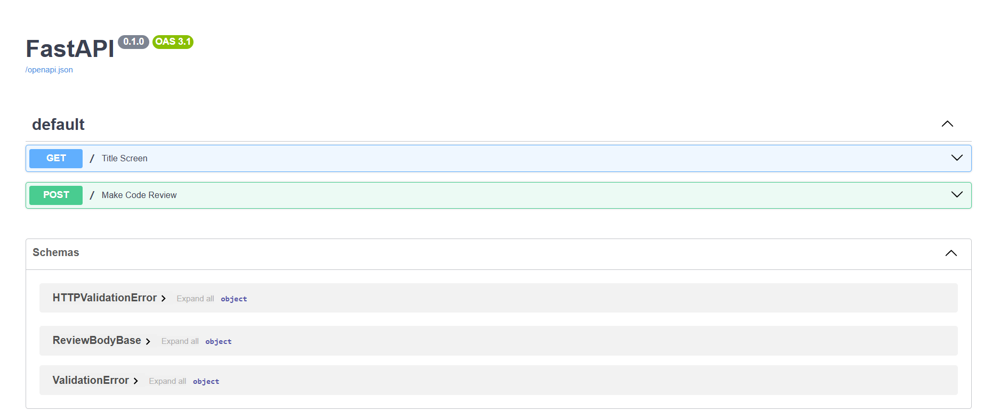
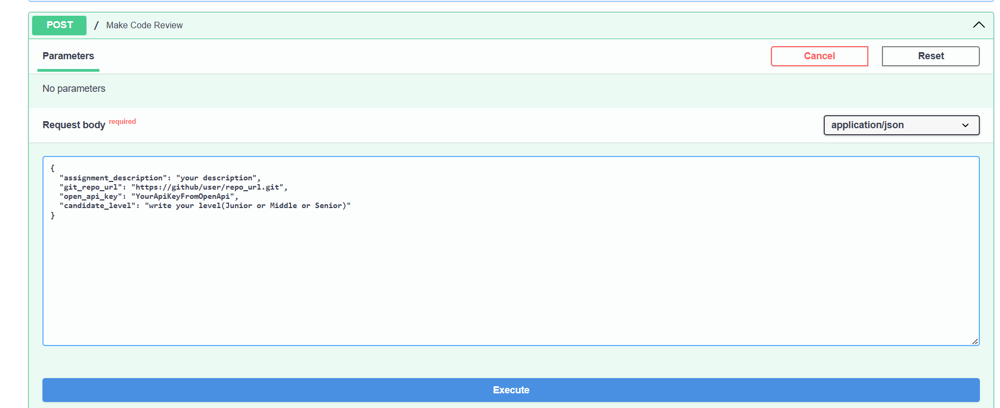

# AI Code Review
## Part 1: instruction
### In order to use this application you will need a development environment such as pycharm or vscode
### Version 1 (without Docker):
#### 1. Clone repository  
```shell
git clone https://github.com/Ivan-Shakhman/AICodeReview.git
cd AICodeReview
```
#### 2. Then, create and activate .venv environment  
```shell
python -m venv venv
venv\Scripts\activate
```

#### 3. Install requirements.txt by the command below  

```shell
pip install -r requirements.txt
```
#### 4. Run local server to use api  

```shell
fastapi dev main.py
```
#### 5. Open in browser  http://127.0.0.1:8000/docs/ (screenshot under show how it must look like)


#### 6. Write your raw data to try it in post method

#### 7. and take your review in response)

### Version 1 (with Docker):
#### 1. Clone repository  
```shell
git clone https://github.com/Ivan-Shakhman/AICodeReview.git
cd AICodeReview
```
#### 2. run docker
```shell
docker-compose -f docker-compose.yaml up --build
```

#### 3. Open in browser  http://127.0.0.1:8000/docs/ (screenshot under show how it must look like)


#### 4. Write your raw data to try it in post method

#### 5. and take your review in response)

## Part 2: thinking

### Well, in general, in order to process 100+ requests per minute, the simplest solution would be to make the tasks asynchronous (create a coroutine and send it to the event loop), since each user uses both their own header and their own AI key, this should not create a large load on the server. As for large repositories, you can simply unload it in parts using Redis for caching and also send it in parts (in general, this is also realistic if you explain to the AI ​​that it should give an answer only after the command, and until then, let it eat the project little by little).

